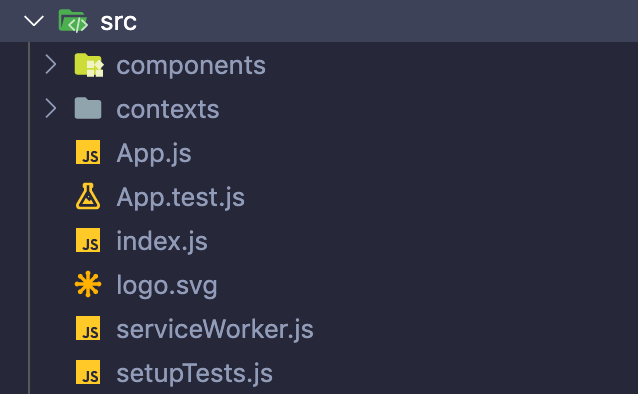
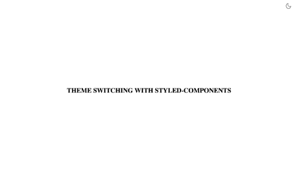

CSS-in-JS has become one of the most popular options for styling React applications. Styled components (styled-components) is a very popular and widely used CSS-in-JS library out there. In this tutorial you will learn how to implement a theme switching mechanism in your React application using the Context API and styled-components.
<br />
<br />

Before we get started, you can see a deployed version of the app [here](https://practical-ardinghelli-d44a52.netlify.app/).

Let's get started by creating a new React app. In your terminal, run the following command.

```
npx create-react-app theming
```

<br />

Go into the **theming** project directory using the terminal and install **styled-components** and **styled-icons** as dependencies.

```
yarn add styled-components styled-icons
```

<br />

styled-icons is an icon library which works with styled-components really well. It's a collection of different icon packages such as Material icons, Feather icons, FontAwesome icons and so on. We're going to use it to add a couple of icons to our app later.

Open the project using your favorite code editor. Inside the **src** folder, create two folders named **components** and **contexts**. The components folder will include a few components that we're going to create. The contexts folder will include the React contexts that we're going to create. We don't need the css files that come with the boilerplate since we are using styled-components for all the styling. Delete App.css and index.css files from the project. Then, open App.js and index.js files and remove the css imports. Now, you should have a structure like below inside your src folder.



<br />

Now we can run the project by running the following command in your terminal.

```
yarn start
```

<br />

Now, it's time to create some components. Inside the components folder, create a file named **Title.js** and add the code below.

```javascript
import styled from "styled-components";

const Title = styled.h1`
  color: black;
`;

export default Title;
```

<br />

Here, we just created our first styled component using the styled-components library. This component will be used to display a title in our application. The syntax, styled.h1 simply means that we're styling the h1 tag and creating a styled component out of it, which is named Title. Inside the backticks, we can write any css as needed. Finally, we export the component, so we can use it in other places of the application.

Let's create another component called ContentContainer. This is simply a component which is going to contain some UI and center them. Create a file named **ContentContainer.js** and add the code below.

```javascript
import styled from "styled-components";

const ContentContainer = styled.div`
  display: flex;
  width: 100vw;
  height: calc(100vh - 60px);
  justify-content: center;
  align-items: center;
  background-color: white;
`;

export default ContentContainer;
```

<br />

Create another file named **TopBar.js** inside the components folder. This is simply a container for the clickable icons that we are going to use to toggle the theme. Add the following code block to the file.

```javascript
import React, { useContext } from "react";
import styled, { css } from "styled-components";
import { Sun, Moon } from "styled-icons/feather"; // import Sun and Moon icons

const Container = styled.div`
  width: "100%";
  height: 60px;
  display: flex;
  justify-content: flex-end;
  align-items: center;
  padding-right: 30px;
  background-color: white;
`;

const icon = css`
  color: black;
  cursor: pointer;
`;

const StyledSun = styled(Sun)`
  ${icon}
`;

const StyledMoon = styled(Moon)`
  ${icon}
`;

const TopBar = () => {
  return (
    <Container>
      <StyledMoon size={32} />
    </Container>
  );
};

export default TopBar;
```

<br />

Inside TopBar.js we import two icons(Sun and Moon) from styled-icons. Then we add some styling to them using styled-components. Finally, inside the TopBar function, we wrap the StyledMoon icon inside the Container styled component and export the TopBar component. For now we're using only one icon here. Later, we will come back to this file and do some modifications.

Now, it's time to add all these components into App.js. Open the App.js file and delete the existing code. Then add the following block of code to App.js.

```javascript
import React from "react";
import ContentContainer from "./components/ContentContainer";
import Title from "./components/Title";
import TopBar from "./components/TopBar";

const App = () => {
  return (
    <>
      <TopBar />
      <ContentContainer>
        <Title>THEME SWITCHING WITH STYLED-COMPONENTS</Title>
      </ContentContainer>
    </>
  );
};

export default App;
```

<br />

Now, if you visit the application inside the browser, you will see something like this.



Now we have the basic UI setup for our application. It's time to work on the theming functionality. To switch betweem themes and to keep track of the active theme, we're going to use the React Context API. Inside the contexts folder, create a file named ThemeStore.js and add the following code.

```javascript
import React, { useState } from "react";

const ThemeContext = React.createContext(); // line A - creating the context

const ThemeStore = ({ children }) => {
  const [theme, setTheme] = useState("light"); // line B - setting the initial theme

  const switchTheme = (theme) => setTheme(theme); // line C - changing the theme

  return (
    <ThemeContext.Provider value={{ switchTheme, theme }}>
      {children}
    </ThemeContext.Provider>
  );
};

export { ThemeStore, ThemeContext };
```

<br />

In **line A**, we create a context named ThemeContext. In **line B**, we use the useState hook in order to set the initial theme state to "light". We can change the theme state by calling the setTheme updater function. In line C, we declare a function called switchTheme. This is the function that we will be calling when we click on the theme toggle icon. Then we create a functional component named ThemeStore which accepts children as props. We wrap the children inside <ThemeContext.Provider>.Then we set the ThemeContext value by passing in the value prop into ThemeContext.Provider. Now the ThemeContext value will accessible from the children that were passed in. This value we just passed in, is an object which has references to the switchTheme function and the theme state. Now, when we wrap children inside <ThemeStore>...</ThemeStore>, they will have access to the switchTheme function and the theme state.

Inside the src folder, create a file named Theme.js. This is where we create our themes. Add the following imports to the top of the file.

```javascript
import React, { useContext } from "react";
import { ThemeProvider, createGlobalStyle } from "styled-components";
import { ThemeContext } from "./contexts/ThemeStore";
```

<br />

ThemeProvider is a component that comes with styled-components which enables us to implement themes easily in our applications. createGlobalStyle is a function which sets global styles for the application such as resetting margins and paddings, setting font sizes etc. Then we import the ThemeContext because, in Theme.js we need to check the current theme value and pass it into the ThemeProvider as the **theme** prop.

Now let's declare our themes and set the global styles.

```javascript
const themes = {
  dark: {
    background: "#272823",
    title: "#6495ed",
    text: "#fff",
  },
  light: {
    background: "#fff",
    title: "#ff6347",
    text: "#000",
  },
};

const GlobalStyle = createGlobalStyle`
  * {
    margin: 0;
    padding: 0;

    transition: all 0.5s;
  }
`;
```

<br />

We just created two themes which are dark and light. Each of the have colors for background, title and text. Then we applied some global styles using the createGlobalStyle function. We set the margins and paddings to 0. Then we set the transition time 0.5 seconds. This we give us a smooth transition effect when switching between themes.

Finally let's create the Theme component and export it.

```javascript
const Theme = ({ children }) => {
  const { theme } = useContext(ThemeContext); // get the current theme ('light' or 'dark')
  return (
    <ThemeProvider theme={themes[theme]}>
      <GlobalStyle />
      {children}
    </ThemeProvider>
  );
};

export default Theme;
```

Inside the function, first we get the current theme value. Then we pass in the correct theme object as the theme prop of ThemeProvider. Everything wrapped inside ThemeProvider will have access to the selected theme. So, when we pass in children props into the Theme component, those children will have access to the currently selected theme since we wrap them inside ThemeProvider.

Now we can update our App.js to use the ThemeStore and Theme. Add the following code to the App.js file.

```javascript
import React from "react";
import ContentContainer from "./components/ContentContainer";
import Title from "./components/Title";
import TopBar from "./components/TopBar";
import Theme from "./Theme";
import { ThemeStore } from "./contexts/ThemeStore";

const App = () => {
  return (
    <ThemeStore>
      <Theme>
        <TopBar />
        <ContentContainer>
          <Title>THEME SWITCHING WITH STYLED-COMPONENTS</Title>
        </ContentContainer>
      </Theme>
    </ThemeStore>
  );
};

export default App;
```

<br />

Now, all the components which are wrapped inside <Theme>..<Theme/> can access the current theme object and use the colors. So it's time to update the components that we created earlier. Let's start with TopBar.js

Change the Container background-color from white to `${(props) => props.theme.background}`. Then, change the icon color from black to `${(props) => props.theme.text}`. Now, your code should look like this.

```javascript
const Container = styled.div`
  width: "100%";
  height: 60px;
  display: flex;
  justify-content: flex-end;
  align-items: center;
  padding-right: 30px;
  background-color: ${(props) => props.theme.background};
`;

const icon = css`
  color: ${(props) => props.theme.text};
  cursor: pointer;
`;
```

<br />

Now, let's update the TopBar function.

```javascript
const TopBar = () => {
  const { theme, switchTheme } = useContext(ThemeContext);

  return (
    <Container>
      {theme === "dark" ? (
        <StyledSun size={32} onClick={() => switchTheme("light")} />
      ) : (
        <StyledMoon size={32} onClick={() => switchTheme("dark")} />
      )}
    </Container>
  );
};
```

We get the theme state and switchTheme function from the ThemeContext. Then, inside the return block, we check the current theme and display the correct icon. And, pass in an onClick listner to each icon in order to set the theme when we click on them. Clicking on the sun icon will enable the light mode. And clicking on the moon icon will enable the dark mode. We're done with TopBar.js. Let's head over to Title.js.

Inside Title.js component, change the color to use the title color which is available in the theme. Now the code should look like this.

```javascript
import styled from "styled-components";

const Title = styled.h1`
  color: ${(props) => props.theme.title};
`;

export default Title;
```

Finally, let's change background color in ContentContainer component to use the background value which is set in the theme. The result would be.

```javascript
import styled from "styled-components";

const ContentContainer = styled.div`
  display: flex;
  width: 100vw;
  height: calc(100vh - 60px);
  justify-content: center;
  align-items: center;
  background-color: ${(props) => props.theme.background};
`;

export default ContentContainer;
```

That's it for this tutorial. Now, you can click on the sun and moon icons to switch between light and dark themes.

You can find the final version of the code on [GitHub](https://github.com/manindu/styled-components-theming)

If you have any questions, feel free to ask them in the comment section below 😊.
